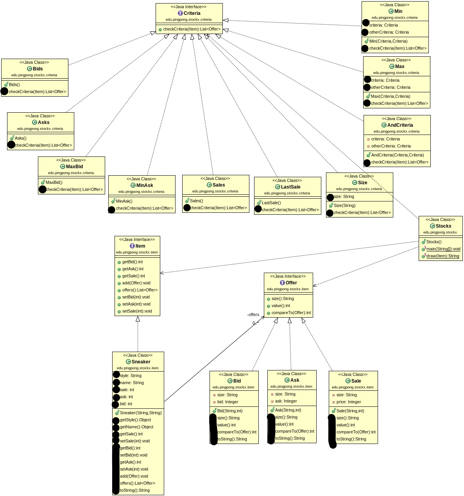

# Stockx Ascii Exam

IMPORTANT! All the starting information was provided by my teacher before doing the exam. (UML, userstories, etc.)

This is a repository to solve the exam simulating a platform in which people can interact between each other to buy or sell Jordans. It is expressed meanwhile CLI in ASCII characters.

The problem statment is located at the repository of my teacher: [dfleta](https://github.com/dfleta/stockx-ascii).

The main app is a replica about the web page called [stockX](https://stockx.com/) which consist in a hub in which people can sell their items and get offers. 

## Design pattern

Since there are a lot of different problems in real life, people have develop and created some models and patters of software architectur in which a problem can be solve efficiently.

This exam is though to be solve using one of the popular design pattern called "Criteria / Filter pattern", since it fits well with the business logic. More information about this design here: [criteria pattern](https://sceweb.sce.uhcl.edu/helm/WEBPAGES-SoftwareDesignPatterns/myfiles/TableContents/Module-10/design_patterns__filter_pattern.html)

## Uml

The UML I used to complete this exercise was the followin:

## User Story

I also used the main APP my teacher gave to us:

[mainApp](./stockasciiexam/src/main/java/edu/craptocraft/stockasciiexam/Stockx.java)

And the users story he builded:

More of this here:

[Users story image](./historias_de_usuaria_GUI/)

Cli User Stories:

More CLI us:

[CLI users stories](./salida_CLI/)
